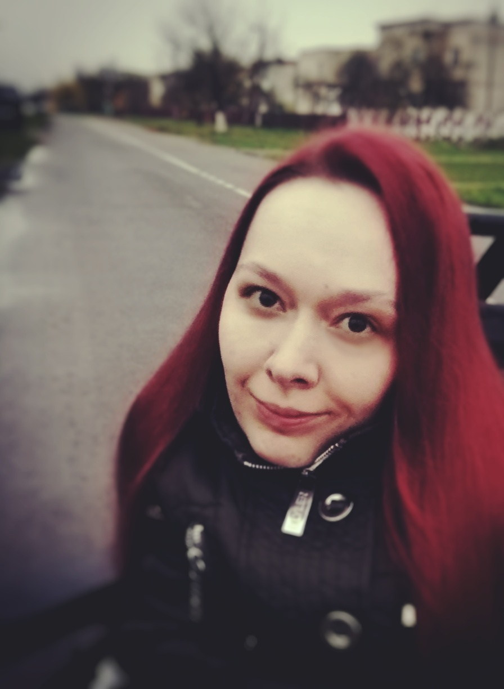

# About me

## 1. Full name:

**Anastasiya Khmara**

## 2. Contacts:

* **Mobile phone:** +375 29 828-09-72 
* **E-mail:** zavetnaya.13@gmail.com

## 3. Summary: 

I love IT :) 

## 4. Skills: 

* HTML5
* CSS3
* Pug
* BEM
* Sass/Less
* Gulp/Grunt
* Git
* Adobe Photoshop
* Figma

## 5. Experience:

### From December 2016

A volunteer lecturer on the basics of HTML and CSS in the local fund to promote the inclusion of people with disabilities **(Minsk, [sova.by](https://sova.by)**). 

### HTML Academy, 2017

**Basic and Advanced HTML and CSS**

## 6. Education:

* **Basics of Programming** (GeekBrains, 2015)
* **Software Tester** (School of Successful Testers, 2015)
* **Basics of HTML and CSS** (Netology, 2016)
* **Basic and Advanced HTML and CSS** (HTML Academy, 2017)

## 7. English level: Pre-intermediate (A2)